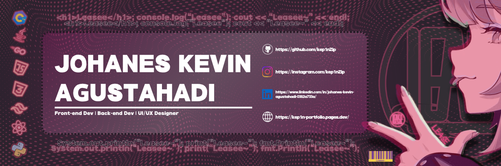

<div align="center">



<br/>

# Hi there, I'm Kevin 👋

<p>
  
  
  
</p>


</div>

---


### 🌸 About Me

```java
@Component
public class Kevin {
    String role     = "UI/UX Designer & Fullstack Dev";
    String campus   = "Telkom University";
    String[] stack  = {"Spring Boot", "React", "Tailwind"};
    String[] hobbies = {"Drifting setups", "Crypto & CS item trading"};
}
```

- 🎓 &nbsp;Undergraduate student at **Telkom University**
- 💻 &nbsp;Focusing on **UI/UX Design** and **Fullstack Development** — *Spring Boot & React*
- 🏎️ &nbsp;Automotive enthusiast with a love for **drifting setups**
- 💹 &nbsp;Trading enthusiast — **crypto** and **Counter-Strike items**
- 🎯 &nbsp;Currently leveling up on clean architecture & design systems

<br clear="right"/>

---

### 🛠 Tech Stack

<div align="center">

**Frontend**


**Backend & Language**


**Tools & Design**


</div>

---

### 📊 GitHub Stats (sadly it won't shows up (9/19/2026))

<div align="center">


</div>

### 📈 Contribution Streak

<div align="center">


</div>

---

### 🌐 Let's Connect

<div align="center">

<a href="https://github.com/kep1nZip"></a>
<a href="#"></a>
<a href="#"></a>
<a href="#"></a>

<br/><br/>


<br/><br/>

<sub>🌹 <i>"Slow is smooth, smooth is fast."</i></sub>

</div>
